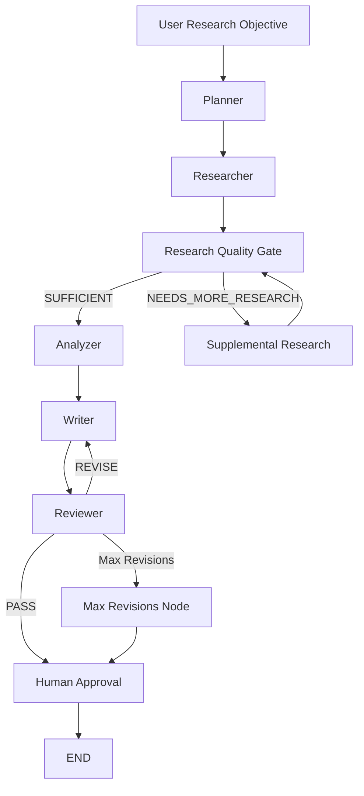

# Market Research Agent

<p align="center">
  
</p>

<p align="center">
  <strong>An agentic market research system that plans research, gathers web evidence, evaluates research quality, analyzes findings, writes and reviews reports, and pauses for final human approval.</strong>
</p>

---

## Overview

**Market Research Agent** is an end-to-end Agentic AI application built with **LangGraph**, **LangChain**, **Tavily**, **OpenRouter**, **LangSmith**, and **Streamlit**.

Instead of producing a market report from a single LLM prompt, the system executes a structured multi-stage workflow:

1. Creates a research plan.
2. Generates targeted search queries.
3. Collects current web evidence.
4. Evaluates research quality.
5. Performs additional research when important evidence is missing.
6. Analyzes the collected evidence.
7. Writes a structured market research report.
8. Reviews the report for factual support and quality.
9. Revises the report when necessary.
10. Pauses for final human approval.

The workflow uses **bounded loops, persistent state, structured outputs, deterministic routing, human-in-the-loop control, and observability**.

---

## Key Features

### Autonomous Research Planning

The Planner converts a broad market research objective into a focused research plan covering areas such as:

- Market size and growth
- Industry trends
- Competitive landscape
- Customer needs
- Pricing and business models
- Risks and barriers
- Market opportunities

### Controlled Web Research

The Researcher uses an LLM to generate a bounded set of targeted search queries.

Python then executes those searches deterministically using Tavily.

This provides controlled autonomy:

```text
LLM decides what to search
        ↓
Python controls how many searches execute
```

This design prevents uncontrolled tool loops while preserving useful agent behavior.

### Research Quality Gate

Before analysis begins, a dedicated quality node evaluates whether the collected evidence is sufficient.

The quality gate can return:

```text
SUFFICIENT
```

or:

```text
NEEDS_MORE_RESEARCH
```

If important evidence gaps remain, the workflow performs targeted supplemental research before continuing.

Research retries are bounded to prevent infinite loops.

### Evidence-Based Analysis

The Analyzer works only from collected research evidence.

It identifies:

- Market trends
- Competitive patterns
- Customer and buyer needs
- Risks and barriers
- Market opportunities
- Evidence gaps
- Areas of uncertainty

The prompts explicitly distinguish **facts** from **interpretations** and prohibit invented statistics.

### Report Writing and Reflection

The Writer produces a structured market research report.

The Reviewer then evaluates the report for:

- Factual support
- Unsupported claims
- Hallucinated statistics
- Irrelevant competitors
- Contradictions
- Missing findings
- Source coverage
- Fact vs. interpretation separation
- Overall clarity

If necessary:

```text
Reviewer
   ↓
REVISE
   ↓
Writer
```

The revision loop is bounded to prevent infinite execution.

### Human-in-the-Loop Approval

After the automated research and review process finishes, LangGraph pauses execution using an interrupt.

The user can then:

```text
Approve
```

or:

```text
Reject
```

The workflow resumes using the same persistent LangGraph thread.

### Persistent Checkpointing

Workflow state is persisted using:

```text
LangGraph + SQLite
```

Each research run receives a unique `thread_id`.

This allows interrupted or incomplete workflows to be resumed later without restarting the entire research process.

### LangSmith Observability

LangSmith provides trace-level observability across the workflow.

Traces include:

- LangGraph nodes
- LLM calls
- Structured-output parsers
- Conditional routers
- Research loops
- Revision loops
- Human interrupts
- Resume operations
- Tavily searches

This makes it possible to inspect where time, tokens, errors, and decisions occur during execution.

### Streamlit Interface

The project includes a professional Streamlit interface supporting:

- New research runs
- Resuming existing research threads
- Persistent workflow state
- Research quality metrics
- Revision counts
- Human approval
- Research report rendering
- Report export

Approved reports can be downloaded as:

- PDF
- Word (`.docx`)
- Markdown
- Plain text

---

## System Architecture



---

## Agentic Design

The project intentionally separates **LLM reasoning** from **workflow control**.

### LLM Responsibilities

LLMs are used for:

- Research planning
- Search query generation
- Research synthesis
- Research-quality assessment
- Analysis
- Report writing
- Report review

### Deterministic Python Responsibilities

Python controls:

- Number of web searches
- Retry limits
- Conditional routing
- Research loop boundaries
- Revision loop boundaries
- State transitions
- Persistence
- Human approval flow

This reduces the risk of uncontrolled autonomous loops.

---

## State Model

The LangGraph workflow shares a typed state across nodes.

Important fields include:

```python
class ResearchState(TypedDict):
    topic: str

    research_plan: list[str]
    research_results: list[str]

    research_quality_status: str
    research_quality_reasoning: str
    research_gaps: list[str]
    additional_queries: list[str]
    research_round: int

    analysis: str

    draft_report: str

    critique: str
    review_status: str
    iteration: int

    approved: bool
```

Two different counters are intentionally maintained:

```text
research_round
```

tracks additional evidence collection.

```text
iteration
```

tracks report revisions.

This keeps the research loop independent from the writing/review loop.

---

## Project Structure

```text
market-research-agent/
│
├── assets/
│   └── logo.png
│
├── src/
│   ├── __init__.py
│   ├── config.py
│   ├── state.py
│   ├── schemas.py
│   ├── tools.py
│   ├── agent.py
│   ├── nodes.py
│   ├── graph.py
│   └── main.py
│
├── .streamlit/
│   └── config.toml
│
├── app.py
├── requirements.txt
├── .gitignore
├── README.md
└── research_checkpoints.sqlite
```

The SQLite checkpoint database is generated locally and should not be committed to source control.

---

## Technology Stack

| Technology | Purpose |
|---|---|
| Python | Application runtime |
| LangChain | LLM integration and structured outputs |
| LangGraph | Stateful agent orchestration |
| OpenRouter | LLM provider gateway |
| Tavily | Web research |
| Pydantic | Structured LLM outputs |
| SQLite | Persistent workflow checkpoints |
| LangSmith | Tracing and observability |
| Streamlit | User interface |
| ReportLab | PDF report export |
| python-docx | Word report export |
| Pillow | Logo/image processing |

---

## Installation

### 1. Open the project directory

```bash
cd market-research-agent
```

### 2. Create a virtual environment

Windows:

```bash
python -m venv .venv
.venv\Scripts\activate
```

macOS / Linux:

```bash
python -m venv .venv
source .venv/bin/activate
```

### 3. Install dependencies

```bash
pip install -r requirements.txt
```

---

## Environment Variables

Create a `.env` file in the project root:

```env
OPENROUTER_API_KEY=
TAVILY_API_KEY=

OPENROUTER_MODEL=google/gemma-4-26b-a4b-it:free

LANGSMITH_TRACING=true
LANGSMITH_API_KEY=
LANGSMITH_PROJECT=market-research-agent

LANGGRAPH_STRICT_MSGPACK=true
```

> Never commit `.env` or API keys to GitHub.

---

## Running the Application

### Streamlit UI

Run:

```bash
streamlit run app.py
```

Then open the local Streamlit URL shown in the terminal.

### CLI Version

The project also includes a command-line interface:

```bash
python -m src.main
```

The CLI supports:

```text
new
```

for starting a new research run, and:

```text
resume
```

for restoring an existing run using its LangGraph `thread_id`.

---

## Example Research Objective

```text
Research the digital payments market in Saudi Arabia for a startup
considering entering the market, focusing on market growth, key
competitors, customer adoption, pricing and business models,
regulatory barriers, and market opportunities.
```

Another example:

```text
Research the premium fragrance market in Egypt for a new local brand,
focusing on market growth, competitors, consumer preferences,
pricing, distribution, barriers, and market opportunities.
```

---

## Workflow Execution

A typical successful run looks like:

```text
Planner
   ↓
Researcher
   ↓
Research Quality Gate
   ↓
SUFFICIENT
   ↓
Analyzer
   ↓
Writer
   ↓
Reviewer
   ↓
REVISE
   ↓
Writer
   ↓
Reviewer
   ↓
PASS
   ↓
Human Approval
   ↓
Approve
   ↓
END
```

If research quality is insufficient:

```text
Researcher
   ↓
Research Quality Gate
   ↓
NEEDS_MORE_RESEARCH
   ↓
Supplemental Research
   ↓
Research Quality Gate
```

The loop is bounded by a configured maximum number of research rounds.

---

## Structured Outputs

Pydantic schemas are used instead of manually parsing model-generated JSON.

Examples include:

```python
ResearchPlan
SearchQueries
ResearchQualityAssessment
ReviewResult
```

This provides more reliable communication between LLM reasoning and deterministic LangGraph routing.

---

## Reliability and Safety Controls

The workflow contains several controls designed to reduce hallucination and runaway execution.

### Bounded Search

The model generates only a limited number of search queries.

### Bounded Research Loop

Supplemental research can execute only a configured number of times.

### Bounded Revision Loop

Writer/Reviewer revisions are capped.

### Evidence-Constrained Prompts

The system explicitly instructs the model to:

- Use only supplied evidence
- Avoid inventing statistics
- Avoid inventing companies
- Avoid fabricated interviews or surveys
- Identify conflicting evidence
- State uncertainty explicitly
- Distinguish facts from interpretations

### Human Approval

The final report is not considered approved until a human explicitly approves it.

---

## Checkpointing vs. Observability

The project intentionally uses two different mechanisms.

### LangGraph Checkpointing

Answers:

> Where is the workflow now?

Used for:

- Persistent execution state
- Interrupt handling
- Resume behavior
- Human-in-the-loop workflows

### LangSmith

Answers:

> What happened during execution?

Used for:

- Node traces
- LLM latency
- Token usage
- Errors
- Parent/child runs
- Router behavior
- Debugging
- Performance analysis

---

## Research Memory vs. Checkpointing

Long-term research memory is intentionally not required for the current implementation.

A checkpoint stores:

```text
execution state
```

A long-term memory system would store:

```text
reusable knowledge across independent research sessions
```

These are separate architectural concerns.

---

## Report Export

After human approval, the Streamlit interface allows the final report to be exported as:

```text
PDF
DOCX
Markdown
TXT
```

Export is intentionally available only after the workflow reaches the final approved state.

---

## Observability Example

A LangSmith trace can show a hierarchy similar to:

```text
LangGraph
│
├── planner
│   ├── LLM
│   └── structured-output parser
│
├── researcher
│   ├── query-planning LLM
│   ├── Tavily searches
│   └── synthesis LLM
│
├── research_quality
│   └── LLM
│
├── research_quality_router
│
├── analyzer
│   └── LLM
│
├── writer
│   └── LLM
│
├── reviewer
│   ├── LLM
│   └── structured-output parser
│
├── review_router
│
└── human_approval
```

This provides visibility into both autonomous reasoning and deterministic workflow behavior.

---

## Design Decisions

### Why LangGraph?

The application is not a simple chatbot.

It requires:

- Explicit state
- Conditional routing
- Loops
- Interrupts
- Persistence
- Human approval
- Controlled retries

LangGraph provides an explicit state-machine architecture for these requirements.

### Why not use a fully autonomous nested agent?

An earlier design used a nested tool-calling agent inside the LangGraph Researcher.

That architecture introduced unnecessary recursive behavior and made execution limits more difficult to control.

The current system instead uses:

```text
LLM query planning
        ↓
bounded deterministic web searches
        ↓
LLM evidence synthesis
```

This preserves useful autonomy while making execution predictable.

### Why separate research quality from report review?

They answer different questions.

The Research Quality Gate asks:

> Do we have enough evidence?

The Reviewer asks:

> Is the report supported, relevant, coherent, and well written?

Keeping them separate allows the system to correct evidence problems before report generation.

---

## Current Limitations

The current version has several intentional limitations:

- Research depends on publicly accessible web evidence.
- Source quality depends partly on search results.
- Market sizing may remain incomplete when reliable public data is unavailable.
- The system does not conduct primary interviews or surveys.
- Human rejection currently ends the run as not approved rather than collecting human revision feedback.
- SQLite is appropriate for the current local prototype but would likely be replaced by a production-grade persistent store for a multi-user deployment.
- Free OpenRouter models may experience provider rate limits or availability changes.

---

## Future Improvements

Potential extensions include:

- Human feedback followed by another Writer revision
- Long-term research memory
- Source credibility scoring
- Automated citation validation
- Better report table rendering in PDF and DOCX
- Research datasets and evaluation benchmarks
- Automated LangSmith evaluators
- Authentication and multi-user research histories
- Production database-backed checkpointing
- Background execution for long-running research
- Cloud deployment

---

## Agentic AI Concepts Demonstrated

This project demonstrates:

- Multi-step agent workflows
- Planning
- Tool use
- Structured outputs
- Shared state
- Conditional routing
- Reflection
- Self-review
- Bounded autonomous loops
- Human-in-the-loop execution
- Persistent checkpointing
- Workflow resumption
- Observability
- Evidence-grounded generation

---

## Disclaimer

This application is designed as a research-assistance system.

Generated market reports should not be treated as a substitute for professional financial, legal, regulatory, or investment advice.

Important business decisions should be validated against primary sources and qualified domain experts.

---

## Author

**Sama El Moataz bellah**

Agentic AI Capstone Project  
Built with LangGraph, LangChain, Tavily, OpenRouter, LangSmith, and Streamlit.
